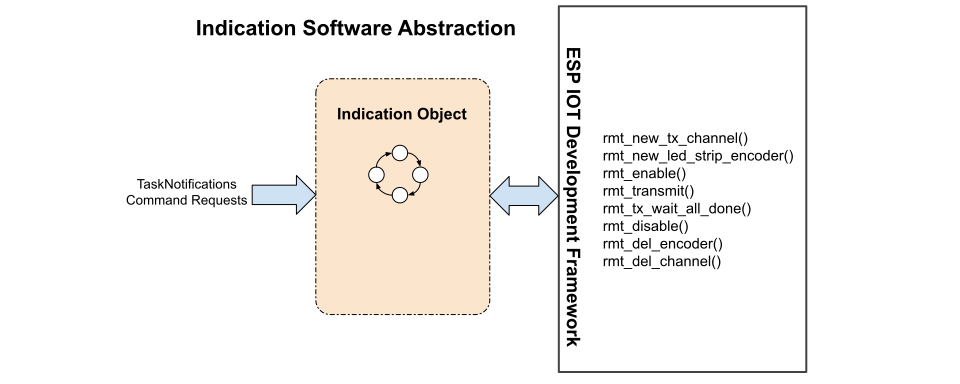

# Indication Abstractions
The Indication object operats a RMT channel and communicated with the ws2812 LED.  It does have a task and operates on its own when it has a code number to display.

___  
