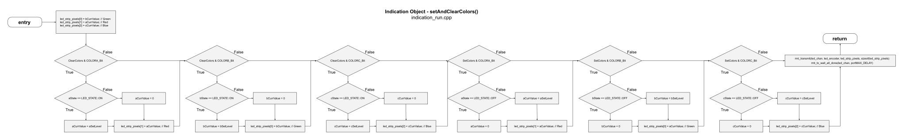

# Indication Flowcharts

___
## indication_run.cpp
This is the primary run function.  
**NOTE: This drawing has become so large that you may not be able to view it inside a browser. You may be forced to download it and view locally.**  
*Work is in progress on this flowchart...*
  

To reduce complexity in the main Run flowchart, this function has been display separately.  
  
___  