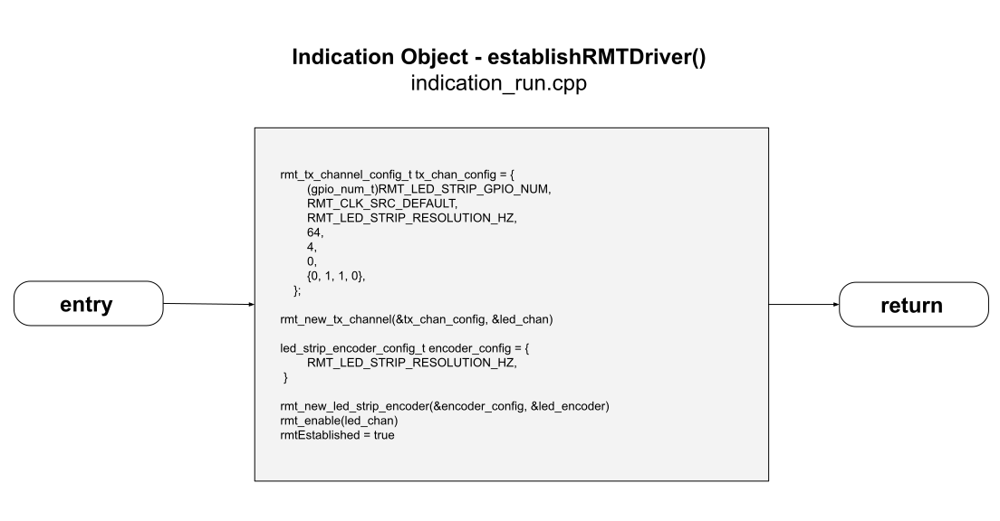
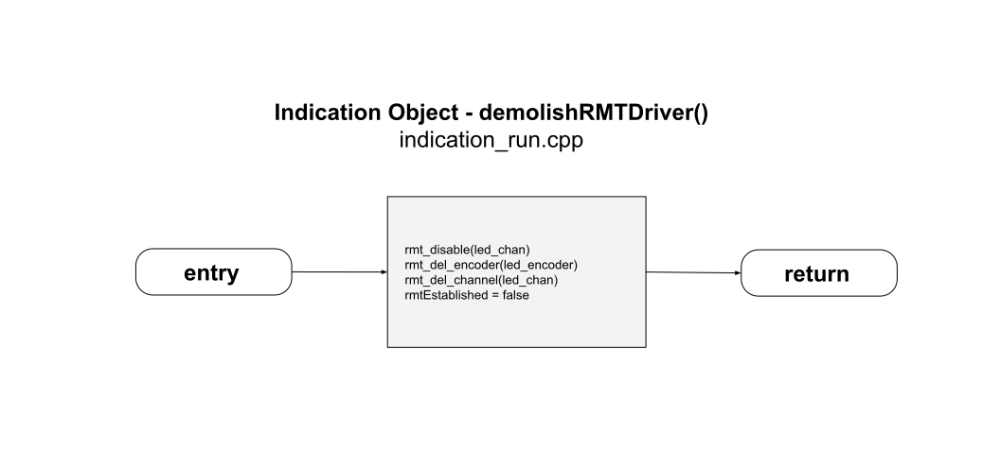

# Indication Flowcharts

___
## indication_run.cpp
This is the primary run function.  For this object, most of its activity is here.  

**NOTE: This drawing has become so large that you may not be able to view it inside a browser. You may be forced to download it and view locally.**  
  

To reduce complexity this **setAndClearColors()** function has been diagrammed separately.  
  
___  
Here is both the enabling and disabling of the RMT Driver and the LED Strip Encoder.
  
 
___  