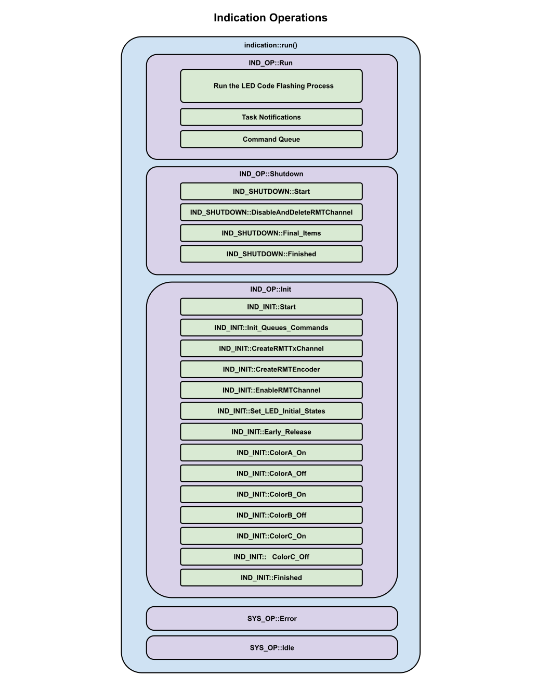

# Indication Operations  
We define a list of operations in indication_enum.hpp.  There are currently 5.  These operations lead to all other sub-operations within the indication object.

* Run Operation
* Shutdown Operation
* Init Operation
* Error Operation
* Idle Operation
* 
### Run Operation
This Run fuction either run the LED process or watches for any RTOS communications.  Our Run process runs at full speed while the LED lighting process is active, but then drops back to a much slower 4Hz while waiting for the next Notification or Command Request to arrive.

### Shutdown Operation
This is a standard call to make through a Task Notification.  This command release all the resourced that are held by the RMT component.  You must release these resouces before you destroy the object if you plan to do something other than a full reboot.

### Init Operation
Most objects have an initialization startup requirement.  Initialization typically occurs right after the creation of the object and during this time the object is usually locked so the outside world can't interfere with it's initialization.   At this time, we don't look for RTOS communication.

### Error Operation
All Error operations everywhere try to handle any recoverable errors at the level for which they exist.  Usually, errors are forwarded on until they reach their highest level and then an error message is routed to a message handler.

### Idle Operation
Idle operation is more of a developmental tool where you can intercept unexepected results.